# All-IN

실행된 이미지

## 메인

### 로그인이 안되어 있을 때

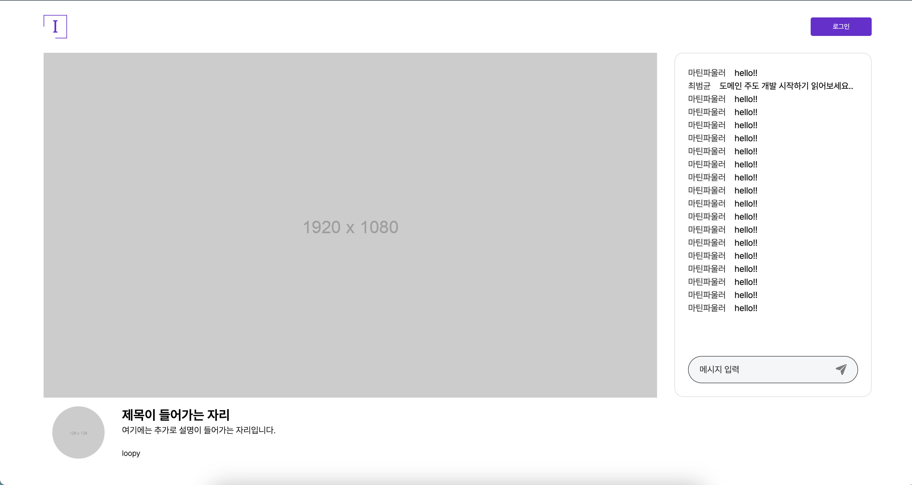

### 로그인 되었을 때

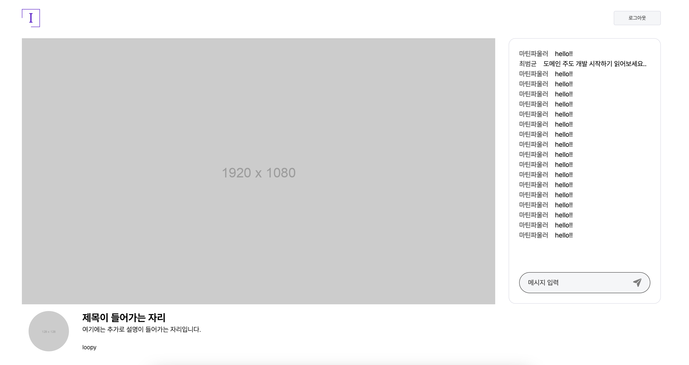

## 로그인

    

        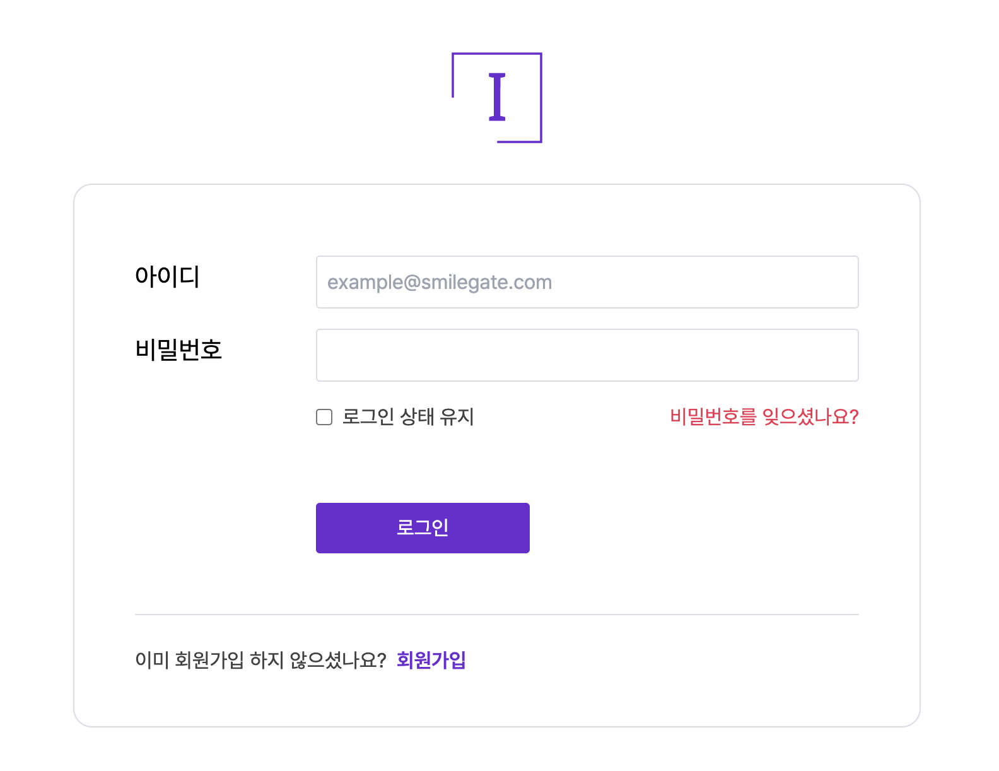
    

    

        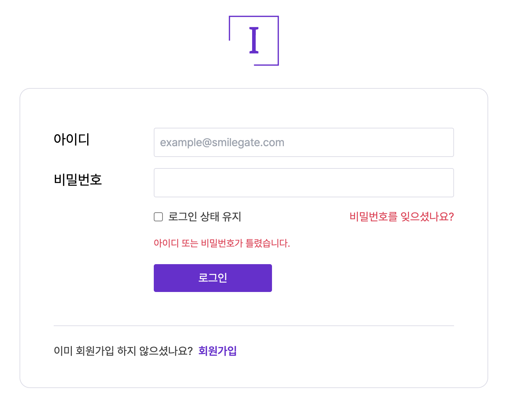
    

## 회원가입

### 회원가입 가입 페이지

    

        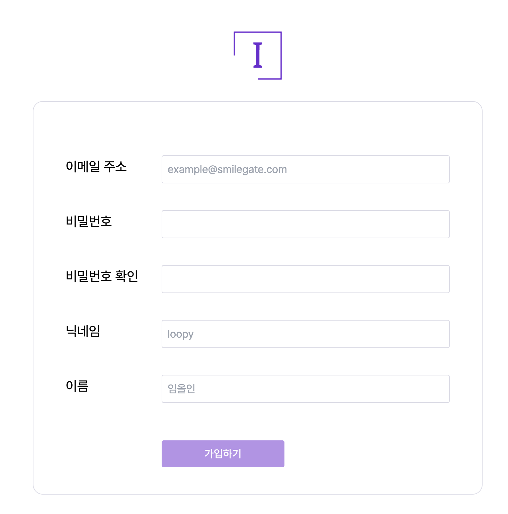
    

    

        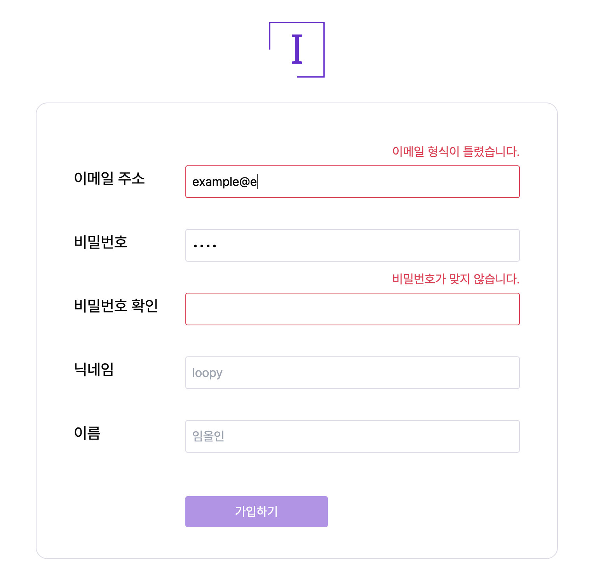
    

## 채팅

### 채팅

    

        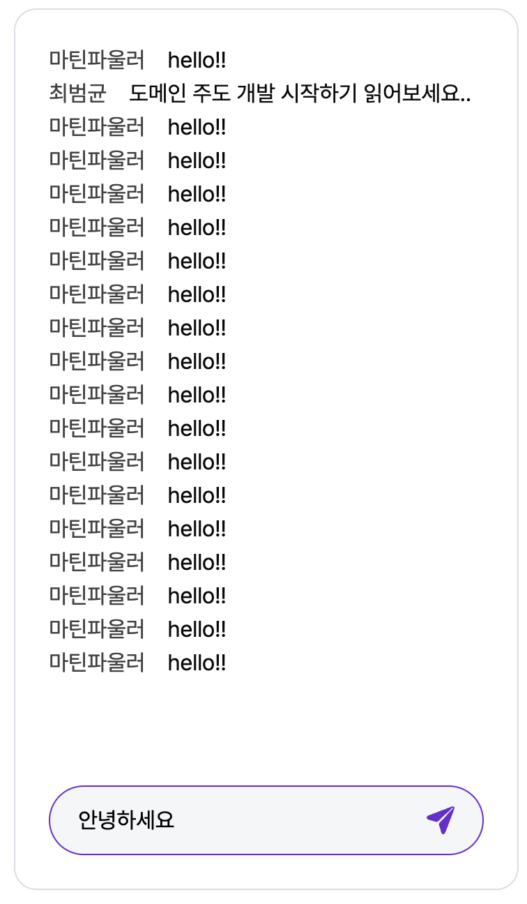
    

    

        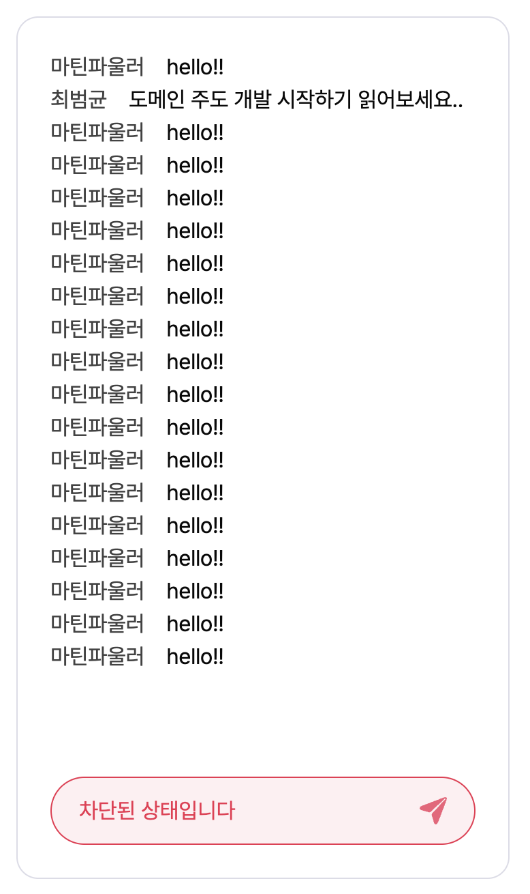
    

    

        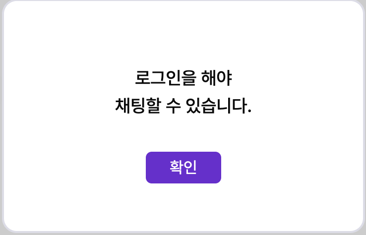
    

### 신고

    

        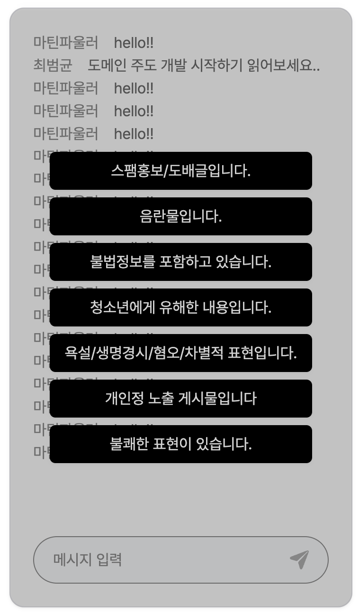
    

    

        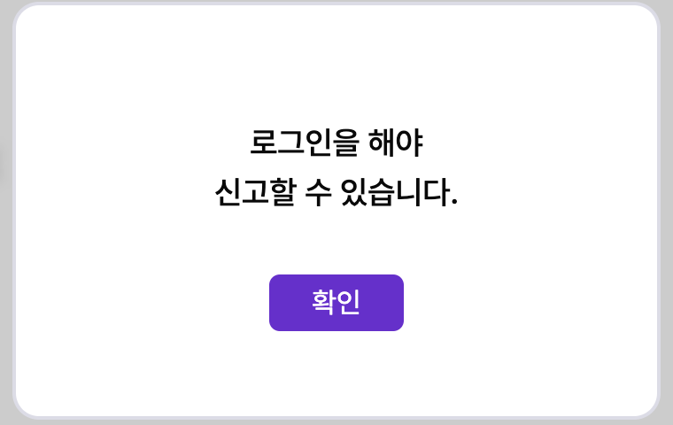
    

